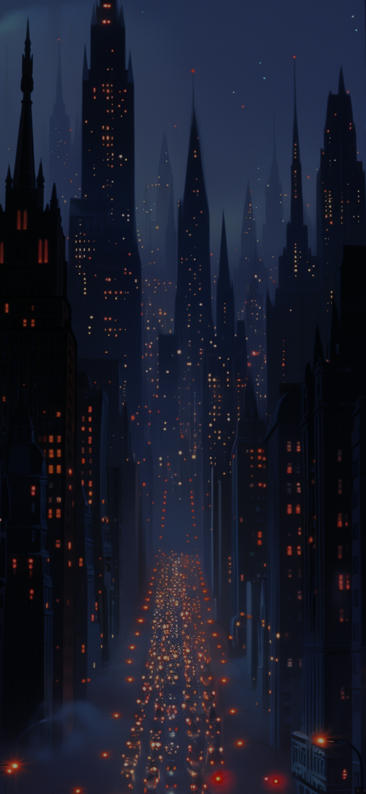

Game Description: "Cursed City" - An exciting game with casino quests immerses the user in the role of the main character, who finds himself in an abandoned city. On his way, he meets a young and beautiful girl asking for help. To help her, the player will have to complete tasks related to slots, overcoming various casino quests.
 Mechanics: The game consists of simple dialogue scenes, where each character's answer leads to one denouement, as well as quests with slots. In quests, the player will have to complete various tasks, such as earning 10,000 chips or making 10 spins.
The game features two types of slots with 3x3 and 3x4 grids. They use the standard reel scrolling mechanics, where the win depends on the bet size. There is also an opportunity to win a huge super prize of 1,000,000 coins if all the elements in each line match.
The game also has a screen for in-game purchases.

